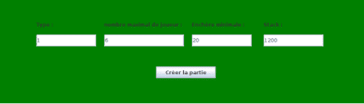
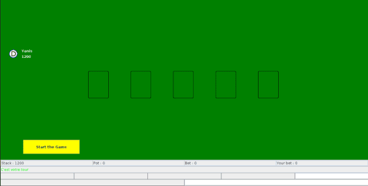
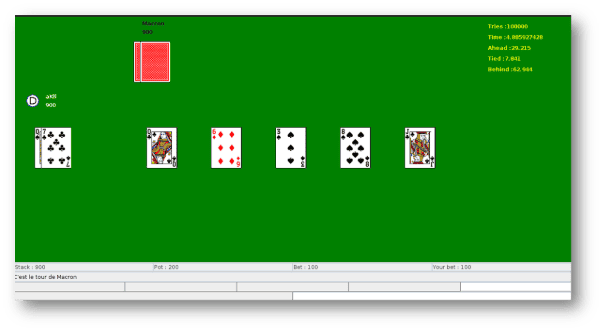
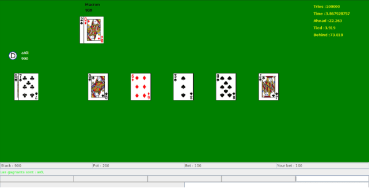

# Poker en Réseau

Multiplayer poker game supporting Texas Hold'em and Five-Card Draw with client-server architecture.

---

## Features
- **Two poker variants**: Texas Hold'em and Five-Card Draw
- **Network play**: Client-server with multi-threading
- **AI opponents**: Basic probability-based AI
- **Dual interface**: GUI (Swing) and terminal text mode
- **Turn timer**: 60-second timeout per turn

---

## Gameplay Screenshots


*Registration screen*


*Pre-flop view*


*Game in progress*


*Game in progress with cards displayed*

---

## Tech Stack
- Java
- Swing (GUI)
- Gradle
- GitLab/GitHub

---

## Setup & Run
```bash
./gradlew build
java -jar server.jar    # Start server
java -jar client.jar    # Start client(s)
```
---

## Known Issues

- All-in partially implemented
- GUI display inconsistencies across machines
- Advanced AI currently non-functional