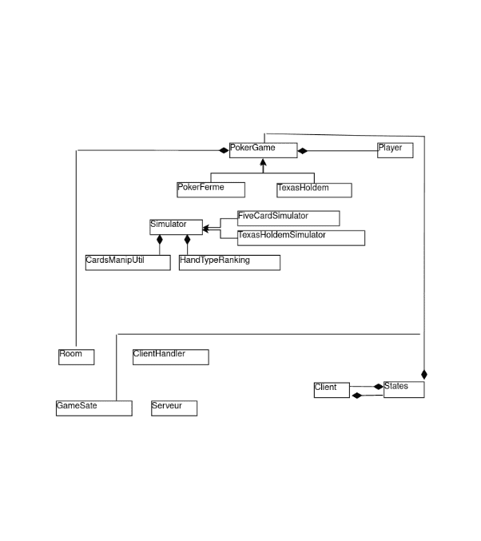

Pour un read me plus propre : veuillez ouvrir le pdf à côté

Poker en

réseau

Encadreur: Vincent CHEVAL Etudiants:

ˆMelissa AKLI ˆAlaeddine CHENIOUR ˆRacha Nadine DJEGHALI ˆAnyes TAFOUGHALT ˆYanis YAHMI

Année: 2021/2022

Contents

Introduction 3 Méthodologie 4

Cahier de charges . . . . . . . . . . . . . . . . . . . . . . . . . . . . . . . . . . . . . . . . . . . . 4 Méthodes de gestion . . . . . . . . . . . . . . . . . . . . . . . . . . . . . . . . . . . . . . . . . . 4 Planication . . . . . . . . . . . . . . . . . . . . . . . . . . . . . . . . . . . . . . . . . . . . . . 4

Conception 6 Architecture globale . . . . . . . . . . . . . . . . . . . . . . . . . . . . . . . . . . . . . . . . . . 6 Diagramme de classes . . . . . . . . . . . . . . . . . . . . . . . . . . . . . . . . . . . . . . 6

Réalisation 8 Parties principales du projet . . . . . . . . . . . . . . . . . . . . . . . . . . . . . . . . . . . . . . 8

Jeu: . . . . . . . . . . . . . . . . . . . . . . . . . . . . . . . . . . . . . . . . . . . . . . . . 8 Analyse des cartes . . . . . . . . . . . . . . . . . . . . . . . . . . . . . . . . . . . . . . . . 8 Interface graphique . . . . . . . . . . . . . . . . . . . . . . . . . . . . . . . . . . . . . . . . 8 Réseau et Simulateur . . . . . . . . . . . . . . . . . . . . . . . . . . . . . . . . . . . . . . . 10 Points forts . . . . . . . . . . . . . . . . . . . . . . . . . . . . . . . . . . . . . . . . . . . . . . . 13 Bugs et problèmes techniques . . . . . . . . . . . . . . . . . . . . . . . . . . . . . . . . . . . . . 13 Outils et Langages utilisés . . . . . . . . . . . . . . . . . . . . . . . . . . . . . . . . . . . . . . . 15 Améliorations envisagées ou Extensions imaginées . . . . . . . . . . . . . . . . . . . . . . . . . 15

Conclusion 16

Introduction

Dans le cadre du cours PI4 de notre deuxième année à l'Université de Paris-Cité, il nous est proposé un projet de 12 semaines nous permettant de mettre en pratique nos connaissances et nos compé- tences professionnelles au travers d'un cahier des charges ayant pour nalité la conception et le développement d'un logiciel qui est un "Jeu de poker en réseau ". Ce dernier nous permet de jouer à deux variantes du poker: le Poker Fermé et le Texas Hold'em en réseau avec une interface qui oppose des joueurs (humains ou robots) via des commandes Serveur-Client.

Les diérentes étapes suivies pour la réalisation de ce projet sont présentées par le biais du présent rapport qui s'articule autour de trois principaux chapitres. D'abord, dans le premier chapitre, nous présentons le cadre général du logiciel et le planning suivi pour sa réalisation. Ensuite, le deuxième chapitre sera dédié à la conception du jeu avec une modélisation par des diagrammes: de classes et de séquence. Quant au troisième et dernier chapitre, il comportera les fonctionnalités du projet, les outils utilisés, les interfaces qui mettent en évidence le fonctionnement du projet et où nous exposerons quelques perspectives futures.

Méthodologie

Cahier de charges

Décrivant l'ensemble des conditions attachées à l'exécution du projet, le cahier des charges nous a permis dans un premier temps, de dénir le contexte, les enjeux, les objectifs techniques ainsi que l'exécutable et les axes de développement envisagés. En organisant nos idées, nous avons ainsi pu vérier la concordance et la faisabilité de notre projet.

Méthodes de gestion

Notre expérience professionnelle et personnelle acquise au cours de cette année d'étude, notamment le cours de Pré-pro2 - Conduite de projet, nous a permis d'aiguiser notre curiosité et de nous ouvrir à d'autres domaines et technologies, et ainsi pour accompagner le développement du projet, dès le début, un plan de gestion de projet a rapidement été mis en place. Ce plan comporte la méthodologie à suivre et les outils nécessaires au bon déroulement de notre projet.

Étant dans une dimension ingénieur, cette gestion est d'autant plus importante que le respect des délais, des coûts et de la performance dans la conception d'un système complexe. Ce dernier permet d'autre part de distribuer les travaux à réaliser entre les membres de l'équipe mais également de créer une base de référence permettant de surveiller les écarts et l'évolution du projet an d'assurer sa continuité.

Planication

Réunion Scrum: Réalisées chaque semaine, notre équipe conçoit un répertoire exhaustif des tâches à accomplir pendant chaque sprint an de mener à bien la création du produit et du suivi de notre travail. En plus de ça, ces pratiques permettent à notre équipe de poser

un cadre et de uidier le développement d'un projet agile dans les meilleures conditions. Plus que le partage d'informations et l'avancement du projet, ces moments d'échanges permettent de partager une vision commune et d'améliorer les méthodes de travail.

"Diviser pour régner": En l'absence d'une organisation bien dénie, un projet peut rapidement s'eacer derrière les impératifs de la struc- ture permanente. C'est pourcela que nousavons opter pourla division en trois sous-équipes et que chacune se charge d'une tâche principale

Conception

Architecture globale

Le projet a été séparé en quatre Packages qui sont: Game, Client, Serveur et IHM, ande garantir la structure et assurer une lisibilité hiérarchique.

Diagramme de classes

Figure 1: Structure des packages.

Figure 2: Diagramme des classes

Réalisation

Parties principales du projet

Jeu:

Deux variantes du poker sont proposées : Poker Texas holdem et Poker fermé. Pour cela on a jugé plus optimale de créer une classe abstraite PokerGame qui étend PokerTexasHoldem et PokerFerme dans lesquelles on a redéni toutes les méthodes non communes.

Analyse des cartes

Pour désigner le gagnant on doit analyser les mains et les comparer. Notre stratégie est de faire en sorte de toujours sélectionner la meilleure main qui puisse être formée. Par exemple, pour le Texas holdem nous avons les deux cartes du joueur plus les cinq sur la table qu'on regroupe et analysait en les triant de diérentes manières (selon leurs rangs ou suit) avec diérentes fonctions telles que sortbyrank, pour ensuite vérier si celle-ci est une royalFlush grâce aux fonctions de la classe HandTypeRankingUtil. Ensuite si c'est un straight Flush, on vérie les mains possibles dans l'ordre décroissant et si on voit qu'aucune suite n'est possible on retourne la plus haute carte.

Interface graphique

Figure 3: Inscription pour une nouvelle partie

Figure 4: -Pré-op

Figure 5: Exemple d'une partie (1)

Figure 6: Exemple d'une partie (2)

En se basant sur nos connaissances en GUI notamment les cours de POO du S3, on a opté pour l'utilisation des bibliothèques de java swing. L'interface comporte un menu de conguration où on peut désigner son nom, la variante de poker voulue, lancer une nouvelle partie et remplir ses caractéristiques (stack, enchère minimale ...etc.) et la possibilité de jouer avec des cartes comme la table du vrai jeu de poker tout en achant les statistiques.

Le principe de notre IHM, est qu'on a créé des listes de Jcomponent, à chaque fois que le client changeait de state et nissait une étape, on vide notre Jpanel et ça se rempli avec la liste de components correspondants à sa situation.

Réseau et Simulateur

//Serveur

while (! serverSocket . isClosed () ){

Socket socket = serverSocket . accept () ;

ClientHandler clientHandler=new ClientHandler ( socket ) ; Thread thread=new Thread( clientHandler ) ;

thread . start () ;

}

Il attend une demande de connexion d'un client, puis lorsqu'un lient se connecte il crée un thread responsable de recevoir et répondre aux requêtes de ce dernier.

//ClientHandler @Override

public void run (){

String messageFromClient ;

while ( socket . isConnected () ){

try{

messageFromClient=bufferedReader . readLine () ;

this . getGameState () . analyseRequest (messageFromClient) ;

}catch (Exception e){

closeEverything () ;

break ; //when the client disconnects , we get out of the while loop

}

}

}

Il attend une requête du client respective et l'analyse.

Quant au client, il a deux threads:

un pour attendre un message du serveur et un autre pour lire l'input de client dans les deux cas il analyse le message sortant et arrivant au client

//Client

public void listenForMessage (){ new Thread(new Runnable() { @Override

public void run () {

String comingMessage ;

while ( socket . isConnected () ){

try {

change = false ;

comingMessage = bufferedReader . readLine () ; analyseComingMessage(comingMessage) ; change = true ;

System . out . println (comingMessage) ;

}catch ( NullPointerException e){

System . out . println ("server has shut down") ; closeEverything ( socket , bufferedReader ,

bufferedWriter ) ;

break ;

}catch (IOException e){

closeEverything ( socket , bufferedReader ,

bufferedWriter ) ;

break ;

}

}

}

}) . start () ;

}

//Client

public void sendMessage (){

Scanner scanner=new Scanner(System . in ) ; while ( socket . isConnected () ){

//get what the user is typing and sent it over

String messageToSend=scanner . nextLine () ; //when enter is pressed in the terminal , wht he typed will be

captured here

messageToSend=messageToSend . trim () ; analyseMessageToSend(messageToSend) ;

try {

bufferedWriter . write (messageToSend) ; bufferedWriter . newLine() ;

bufferedWriter . flush () ;

}catch (IOException e){

closeEverything ( socket , bufferedReader ,

bufferedWriter ) ;

break ;

}

}

}

Lorsque le serveur est dans la phase d' identication: on doit fournir un nom et donner une autre requête hormis "HELLO PLAYER name" va donner une erreur. Ensuite il se transmet au menuState qui exige au client de créer une partie ou de rejoindre une, en eet eectuer une autre requête va lui générer une erreur, puis il passe au waitingState pour attendre que les joueurs rejoignent la partie et enn commence la phase du jeu .

Le Timer:

Lorsqu'un joueur ne repend pas à une requête au bout de 60 secondes est retiré de la partie.

private Timer timer ;

private Set<RunOutOfTimeTask> taskset ;

A chaque fois qu 'un joueur doit répondre a une requête on doit ajouter dans le set un nouvel TimerTask qui appelle clientquit() si ce dernier n'a pas répondu.

Draw Cards Draw 4 Cards 

Create Deck Shuffle Deck for both 

for Board

Players

Evaluate  Compare 

each Player's  scores of  Print who Cards both Payers wins

Figure 7: -Pré-op

Simulateur:

Deux types de simulateurs un pour chaque variante de poker.

Pour le Texas Hold'em:

On génère plusieurs decks, puis pour chacun on distribue les cartes pour les joueurs ainsi que sur la table (en préservant la main pour le joueur client), puis selon les combinaisons générées on compare les mains et on désigne le ou les gagnants.

Pour le Poker Fermé

Même principe que le Texas Hold'em la seule diérence est que si un joueur veut changer n cartes on lui retire les n cartes aléatoires et on lui donne n cartes du deck.

Problèmes techniques du serveur:

-Les threads d'un même serveur partagent un même objet Room (Concurrency Exceptions).

-Chaque requête peut être interprétée diéremment suivant l'état du jeu ou les décisions du Client.

Solutions:

-Utiliser des Synchronized ArrayLists .

-Utiliser des Attributs privés.

-Utiliser le State Pattern pour le Client/Serveur an de savoir quelles requêtes sont valides.

-Le Serveur et le Client doivent avoir les mêmes informations du jeu.

Points forts

ˆImplémentation de plusieurs stratégies intéressantes par exemple: dans

l'analyse des mains on retrouve un soucis avec la carte AS (car présent dans plusieurs combinaisons), an d'y remédier, nous l'avons mis au début et à la n lorsqu'on trie pour vérier à la fois la possibilité qu'il y ait une RoyalFlush mais aussi une suite (1-2-3-4-5) et donc en prenant l'AS comme la carte la plus forte, ensuite la plus petite.

ˆAlgorithme pour l'IA permettant de dénir l'action à jouer en utilisant la

probabilité (Au lieu de faire Random)

ˆLe jeu peut être jouer en version graphique comme en version textuelle (Ter-

minal en commandes).

ˆServeur-Client avec utilisation des threads: //A compléter

Bugs et problèmes techniques

ˆNon implémentation totale de la fonctionnalité AllIn.

ˆEn allant d'une IA random vers une IA performante nous avons rencontré

plusieurs problèmes au niveau du serveur malgré la correction des algorithmes utilisés ce qui nous laisse avec une IA non fonctionnelle!

ˆBugs au niveau de l'interface graphique principalement à cause de

l'incohérence des résultats sur deux machines diérentes.

Outils et Langages utilisés

ˆGitLab, GitHub ˆJava, Latex, UML ˆintellij, gradle

Améliorations envisagées ou Extensions imaginées

ˆEn plus des deux variantes imposées, nous voulions en implémenter d'autres. ˆInterface graphique améliorée.

ˆIA performante fonctionnelle.

Conclusion

Cette année, pour la première fois dans notre cursus, nous avons eu comme projet pour le moins enrichissant et formateur la réalisation d'un logiciel from Scratch .

Nous avons mené une étude et conception en papier jusqu'à la mise en service du produit. Après une analyse du cahier de charge, nous avions en tête quelques bases et méthodes scolaires concernant l'élaboration d'une solution pour ce dernier, mais nous ne connais- sions ni les processus en amont, ni les processus en aval.

Le projet avait cette particularité de rassembler divers disciplines: Programmation Orientée Objet, Programmation réseau en Java, Logique Mathématique, Probabilités et Statistiques et bien d'autres. Cette pluridisciplinarité fut un obstacle que nous avons surmonté grâce aux compétences multiples et à la polyvalence de notre équipe. Cette plurivalence a notamment été mise à prot dans l'attribution des tâches an que chacun tire parti de ses accomplissements.

Enn, les temps impartis à la réalisation du jeu furent bref et il a fallu faire preuve de exibilité et de persévérance, parfois pour re- specter les délais, parfois pour respecter les contraintes technologiques imposées par le projet. Somme toute, nous avons retrouvé lors de ces quatre mois,les compétences, les contraintes mais aussi l'excitation d'un vrai projet d'entreprise.
15
